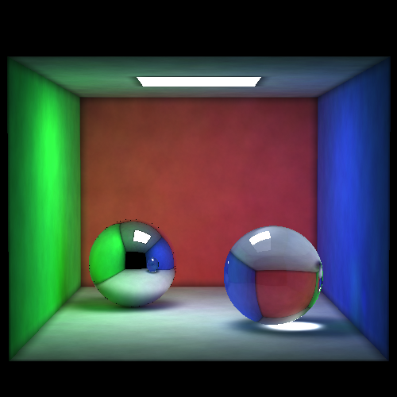

# An implementation of the photon mapping

フォトンマップのレンダラーの実装です。

３次元モデリングとレンダラー共に全て独自実装です。JavaとScalaの標準ライブラリしか使っていません。

以下は、1000000個フォトンを使用し、フォトンの半径が0.2の場合のレンダリング結果です。

詳細は以下のブログ記事を参照してください。

[ブログ記事](http://cheetahs-blog.blogspot.jp/2014/03/blog-post_27.html)
